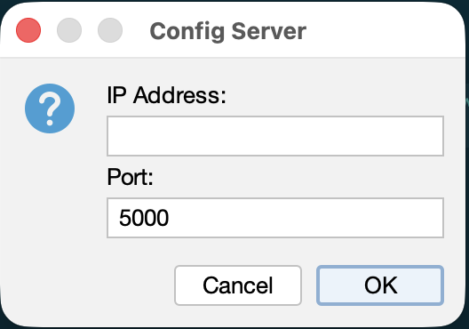
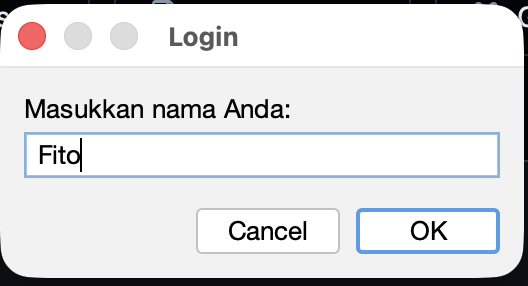
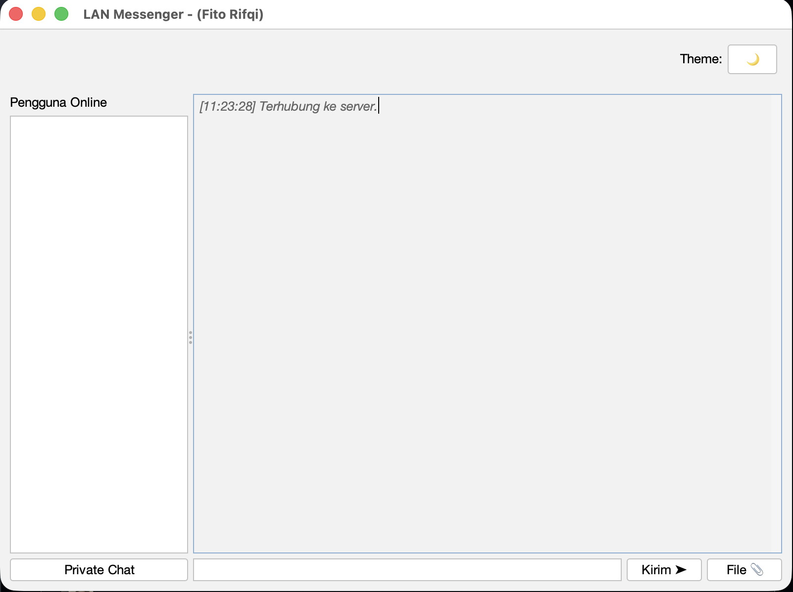

<div align="center">
  

  # 💬 LanMessenger
  **Aplikasi Chat Jaringan Lokal (LAN) yang Aman, Cepat, dan Modern**

  [](https://openjdk.java.net/)
  [](https://maven.apache.org/)
  [](https://www.formdev.com/flatlaf/)
  [](https://opensource.org/licenses/MIT)

  [Fitur](#-fitur) • [Instalasi](#-instalasi) • [Cara Penggunaan](#-cara-penggunaan) • [Arsitektur](#-arsitektur) • [Kontribusi](#-kontribusi)
</div>

---

## 📖 Deskripsi Proyek

**LanMessenger** adalah aplikasi perpesanan desktop ringan lintas platform yang dirancang khusus untuk **Local Area Network (LAN)**. Dibangun menggunakan Java dengan antarmuka **FlatLaf** yang modern, aplikasi ini menyediakan lingkungan yang mulus dan aman untuk komunikasi tim, berbagi file, dan diskusi pribadi tanpa memerlukan koneksi internet aktif.

Sangat cocok untuk digunakan di lingkungan kantor, sekolah, atau jaringan lokal pribadi yang mengutamakan privasi, kecepatan, dan ketersediaan secara luring (offline).

**Topik Terkait:** `Java`, `Socket Programming`, `LAN Chat`, `Desktop App`, `Maven`, `FlatLaf`, `Cryptography`, `Client-Server`

## ✨ Fitur

- 🔒 **Keamanan End-to-End** – Pesan dienkripsi menggunakan `CryptoUtil` bawaan sehingga orang lain di jaringan tidak dapat menyadap percakapan Anda.
- ⚡ **Komunikasi Real-Time** – Arsitektur Client-Server berbasis Socket TCP/IP yang menjamin pengiriman pesan tanpa latensi.
- 🎨 **Antarmuka Modern (UI)** – Menggunakan [FlatLaf](https://www.formdev.com/flatlaf/) untuk tampilan yang bersih dan elegan, berbeda dengan tampilan bawaan Java Swing pada umumnya.
- 👥 **Chat Global & Pribadi** – Kirim pesan ke semua orang di dalam jaringan atau mulai sesi percakapan rahasia secara 1 lawan 1 (Private Chat).
- 📎 **Transfer File** – Bagikan dokumen dan berbagai jenis file secara langsung melalui chat.
- ↩️ **Sistem Balas Pesan (Reply)** – Membalas pesan secara spesifik agar alur percakapan tetap terorganisir.

## 🚀 Instalasi

### Prasyarat
Sebelum memulai, pastikan sistem Anda memiliki:
* **Java Development Kit (JDK)**: Versi 17 atau yang lebih baru.
* **Apache Maven**: Untuk manajemen dependensi dan build proyek.

### Clone Repositori
```bash
git clone https://github.com/fitorifqi/LanMessenger.git
cd LanMessenger
```

### Build menggunakan Maven
Unduh dependensi dan kompilasi proyek dengan perintah berikut:
```bash
mvn clean install
```

## 💻 Cara Penggunaan

LanMessenger membutuhkan satu aplikasi **Server** yang berjalan, dan beberapa aplikasi **Client** yang terhubung ke server tersebut.

### 1. Jalankan Server
Jalankan server agar siap menerima koneksi dari para klien:
```bash
mvn exec:java -Dexec.mainClass="projek.lanmessanger.ChatServer"
```
> **Catatan:** Server akan berjalan di port `5000` secara default. Catat IP Address dari komputer yang menjalankan server ini.

### 2. Jalankan Client
Buka jendela terminal baru dan jalankan aplikasi klien:
```bash
mvn exec:java -Dexec.mainClass="projek.lanmessanger.ChatClient"
```
Saat aplikasi terbuka, sebuah jendela konfigurasi akan muncul:
- Masukkan **IP Address** dari Server (gunakan `localhost` atau `127.0.0.1` jika Anda mencoba di komputer yang sama).
- Masukkan **Port** (`5000`).
- Klik **OK** untuk terhubung dan mulai mengobrol!

## 📸 Screenshots

<div align="center">

| Konfigurasi Port | Halaman Login | Lobi Chat Global |
| :---: | :---: | :---: |
|  |  |  |
</div>

## 🏗️ Arsitektur

```text
LanMessenger/
├── pom.xml                        # Konfigurasi Maven & Dependensi
└── src/main/java/projek/lanmessanger/
    ├── ChatServer.java            # Logika utama server & penangan koneksi klien
    ├── ChatClient.java            # Aplikasi GUI utama untuk Client (Chat Global)
    ├── NetworkClient.java         # Penanganan jaringan Socket (TCP/IP)
    ├── PrivateChatWindow.java     # GUI khusus untuk pesan pribadi (1-on-1)
    ├── CryptoUtil.java            # Utilitas untuk mengenkripsi/mendekripsi pesan
    └── ClientListener.java        # Interface untuk menangani event dari jaringan
```

## 🤝 Kontribusi

Kontribusi adalah hal yang membuat komunitas open-source menjadi tempat yang luar biasa untuk belajar, berbagi inspirasi, dan berkreasi. Segala bentuk kontribusi dari Anda akan **sangat dihargai**.

1. Fork Proyek ini
2. Buat Branch Fitur Anda (`git checkout -b feature/FiturKeren`)
3. Commit Perubahan Anda (`git commit -m 'Menambahkan FiturKeren'`)
4. Push ke Branch (`git push origin feature/FiturKeren`)
5. Buka sebuah Pull Request

## 📄 Lisensi

Didistribusikan di bawah Lisensi MIT. Lihat file `LICENSE` untuk informasi lebih lanjut.

---
<div align="center">
  Dibuat dengan ❤️ oleh Fito Rifqi
</div>
